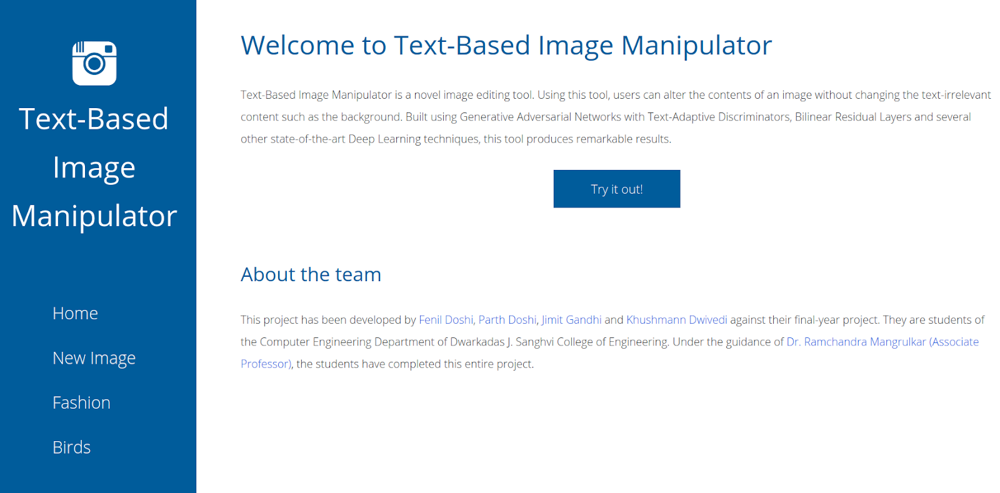
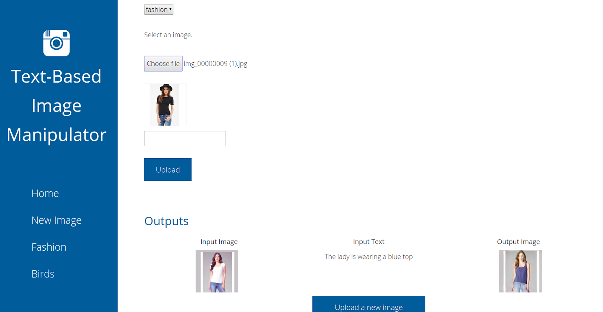
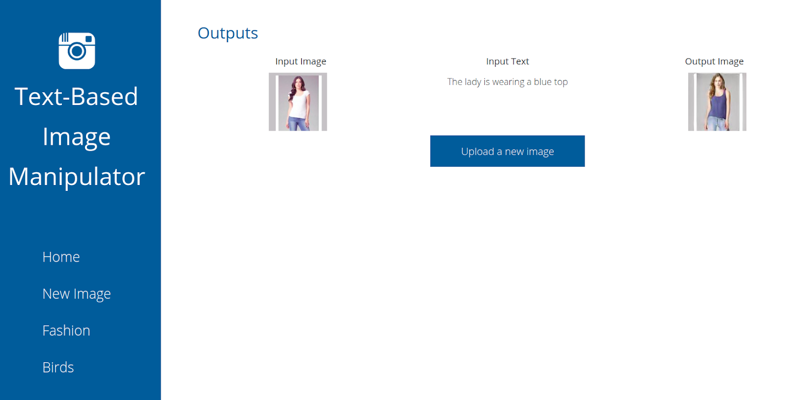
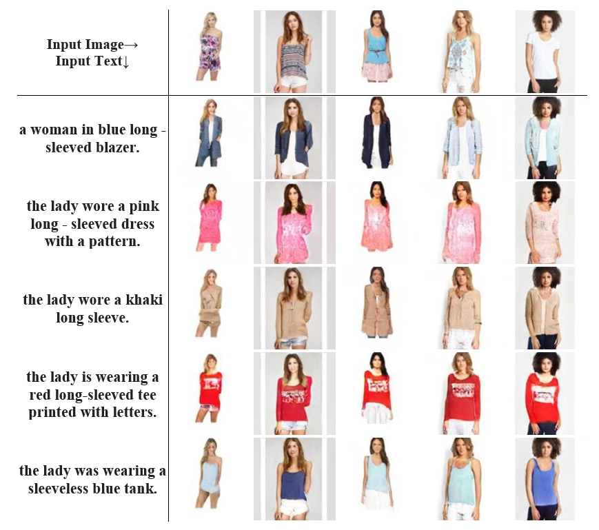

## Image Modification using Natural Language Description with Generative Adversarial Networks

Python 3.6 required for Django 3

This is a web application created with Django that allows users to modify the colour, shape and size of outfits based on a simple language description (in English).

The model was created using conditional Generative Adversarial Networks (GANs) using a Text Adaptive Discriminator and a novel biliner residual layer for efficiently merging text and Image representations.
- Texts are represented using Fasttext embeddings and was passed through GRU network.
- Images are represented by a feature vector after they have been passed through a Encoder convolutional network.

The loss function is a standard minimax loss function along with reconstruction loss so that text-irrevelant features of the images are preserved.

Text Adaptive Discriminator provides feedback to the Generator based on whether the generated image is matching to the text description.

The model was evaluated on using human-based evaluation over 3 parameters => "naturalness of the image"; "required modification based on text description" and "no changes in text-irrevelant features".

<b>Demonstration of the web application -><b>

1. Landing page

2. User is allowed to upload an image and provide a text description of how he wishes that Image is modified.

3. Examples of how the model performs.

